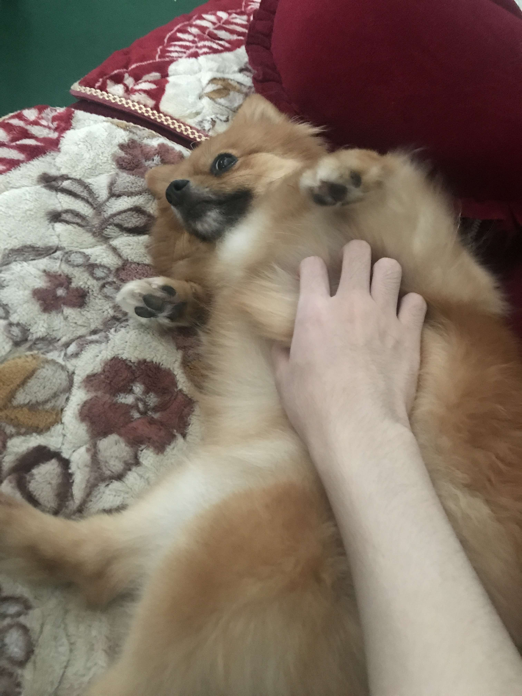

# Lucas' Github page
## About me


(I just wanted to show off how cute my dog was.)
### Story
I'm an **second year** CS student at UCSD. *I'm international so my home country is ~~Burma~~ Myanmar*. **Its been _over a year_ since I came to the US.** ***I chose to pursue CS as my major since I always loved tinkering with things and getting them to work.*** I know this sounds more like <sub>CE</sub> but I'm not too into hardware. I've tried them out but I find it <sup>really</sup> tedious. I'm currently intersted in exploring <ins>AI and Web Dev</ins> as possible markets to go into. 
### Hobbies 
I enjoy playing guitar or games whenever I have free time. I didn't even like the guitar initally but was convinced by my mom's following words:
> I think guys who play guitar are cool. You should learn

I also just like to create random programs which I think are useful for me. Some commands I've recently learned are `git branch` to check what branches I have. Afterwards, I do something like 
```
git status
git fetch
git checkout
```
to get to the branches i want. My favorite colors when coding are `#ffffff` and `#123456`.

When I am really bored, I'm go over to [Youtube](https://www.youtube.com/watch?v=dQw4w9WgXcQ).

Go back here to get to the dog: [About Me](#about-me)

Otherwise if you want to view the readMe for this repo, [click here](README.md).

## Clubs

Through my time at UCSD, I've mainly been involved in CSES, holding the following positions
- Finance Chair
- Finance Director
- Web dev Developer

Outside of CSES, you might also spot me at the following social clubs
1. Bursa
2. NSU
3. JSA

## Connect with Me!

These are the platforms you can find me on:
- [X] Insta!
- [X] Linkedin.
- [ ] Facebook
- [ ] X